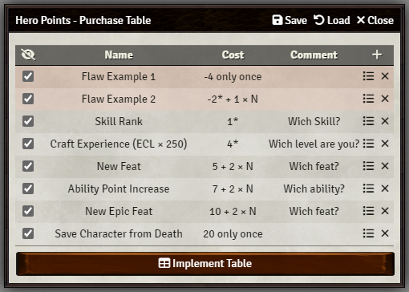
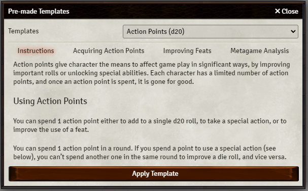
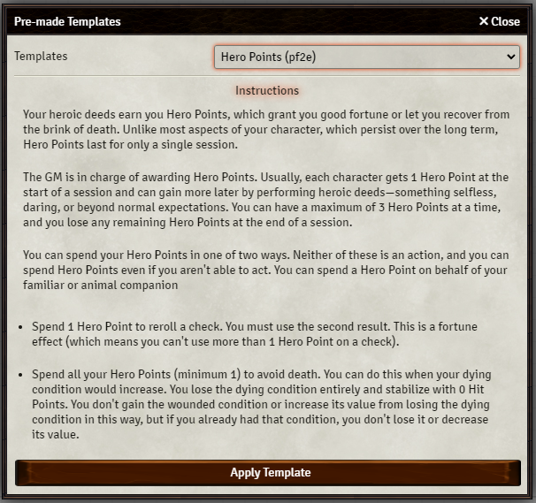
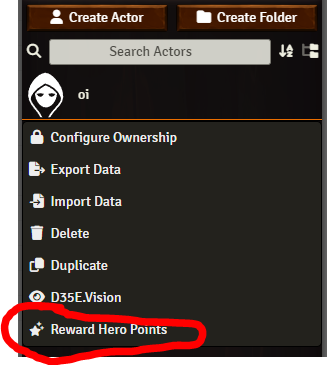
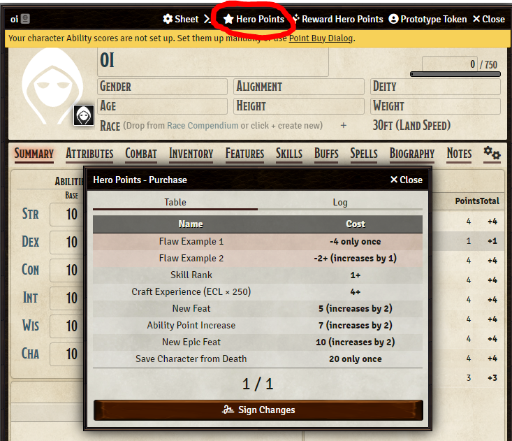
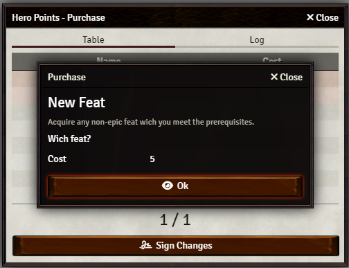
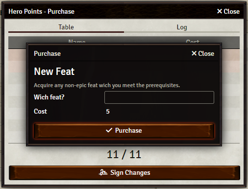

# Foundry VTT Module: Hero Points ➕

Create your own character progression subsystem, or implement your own inspiration-like system, compatible with any system in Foundry VTT.

### Why?

-   You can implement Hero Points, Action Points and several other similar optional rules, for several different systems
-   Sometimes players get bored with the way their character progress in the system, a new progression subsystem can make them more interested and help differentiate their characters from others in your world
-   You can develop more ways of punishing or rewarding your players than simply giving out XP for killing monsters, an idea is only rewarding Hero Points for roleplay, or achievements not relying on combat
-   The system is very flexible, you can create flaws, set items wich can only be bought once, items wich increase in cost with every purchase, items wich require additional information to be bought

### How to Use It

First you need to configure and implement your purchase table. Once that is done, you should reward your players with some Hero Points, or maybe change its name to something else: _Paragon Points_, _Action Points_, _Inspiration_, _Story Points_, etc.

#### Configurable Purchase Table

You can configure your own table so your game is unique:

#### Templates

If you prefer you can use some common templates:

#### Reward

To reward an actor you click either in the context-menu or within the header of an Actor Sheet:

#### Screen Button

You can set an icon or some other image to show up on screen when a player has points to spend. The icon can be moved around with the middle mouse button.

#### Character Purchases

If an actor has hero points, a button on the Actor sheet header will show up. Clicking it opens the purchase menu:

If the player can't buy the item he can still see what it does:

If enough points he can purchase it:

The GM is always in complete control and can remove purchases and remake the log history as they wish.

### FAQ

[Release Notes](https://raw.githubusercontent.com/elizeuangelo/fvtt-module-hero-points-faq/master/releases.md)
[Issues](https://github.com/elizeuangelo/fvtt-module-hero-points-faq/issues)
